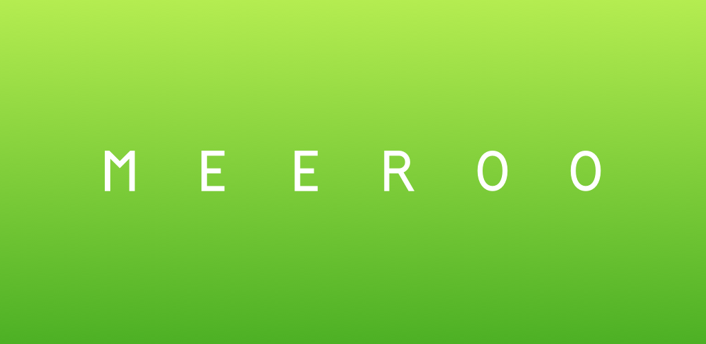

# MeeRoo

An android app to manage reservations for meeting rooms.

Main purpose of this app is to display the availability of an meeting room. It is expected to have 
one tablet or phone next to the meeting room to see if it is available, see the current and upcoming 
meetings and reserve the room now or in the future.
There is an overview for all meeting rooms, too. This makes it easy to find available rooms or a 
current meeting very quickly.

## How it works
The app reads calendar and event data stored on the device. To get this to work the 
calendars must be configured in the android calendar on the device. 
On the first start of the app you have to choose the calendar mode (for synchronization). 
This is necessary, because Google Calendar marks meeting rooms as resources. 
With CalDav synchronised calendars are storing every calendar as normal calendars, no difference 
between a personal calendar and a meeting room (resource).

### Supported calendar synchronizations
* Google Calendar
* CalDav Calendar

## Current version
1.0

The idea and design of this app is inspired by https://github.com/futurice/meeting-room-tablet.
